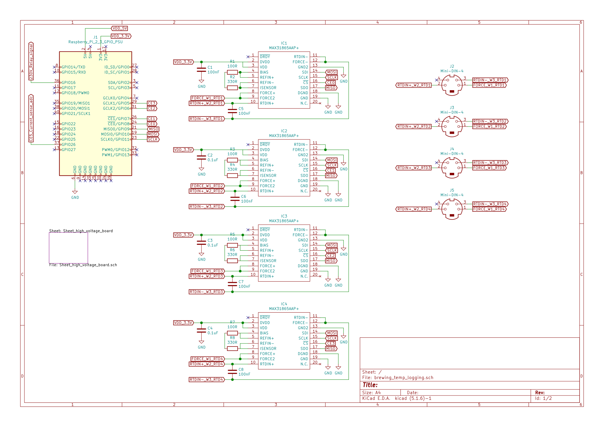
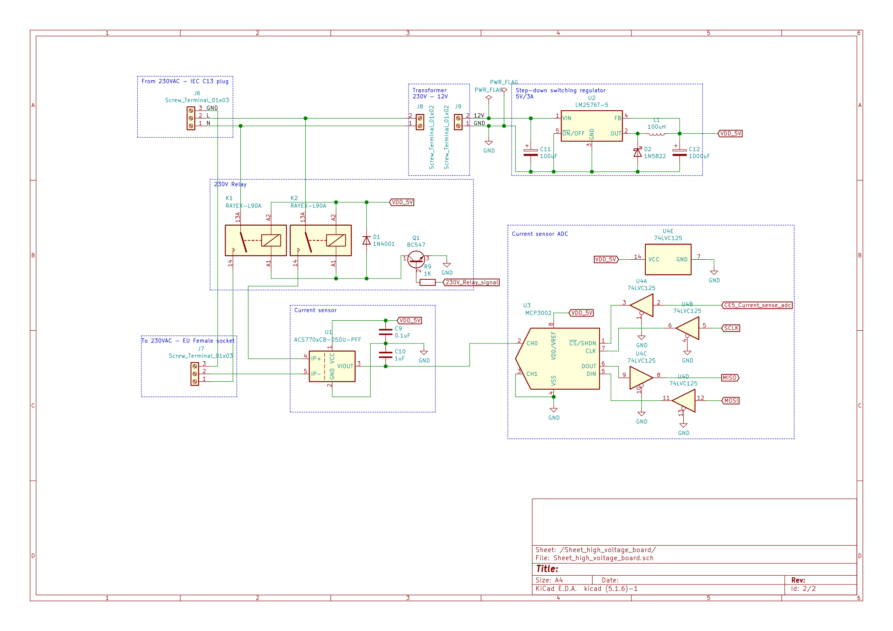
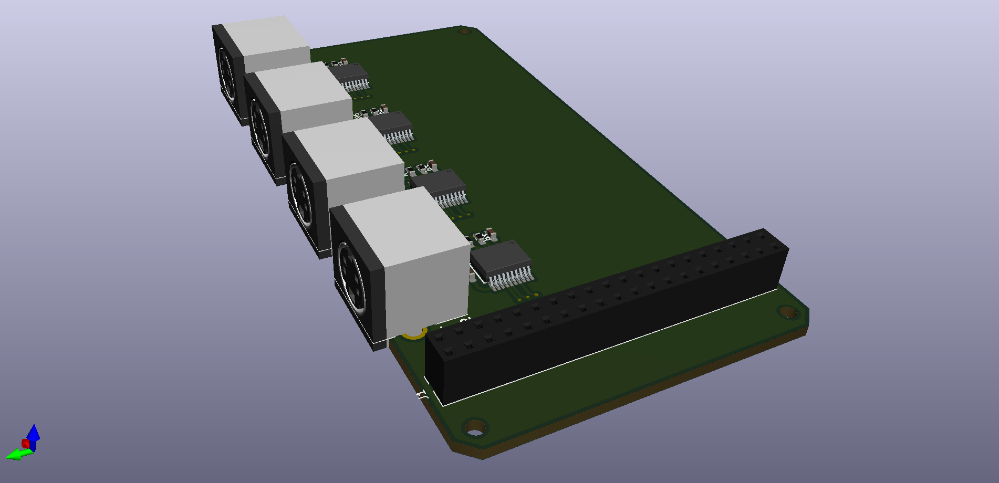

# Brewing controller
A board to control a brewing-rig.

## Images
Temprature sensor ADCs and connectors to the TP100 elemts

230V current sensing, relay control and 230V to 12V/5V tranformer

3D render of temprature ADCs and connectors

## Development
Requires [KiCad EDA](https://kicad-pcb.org/)